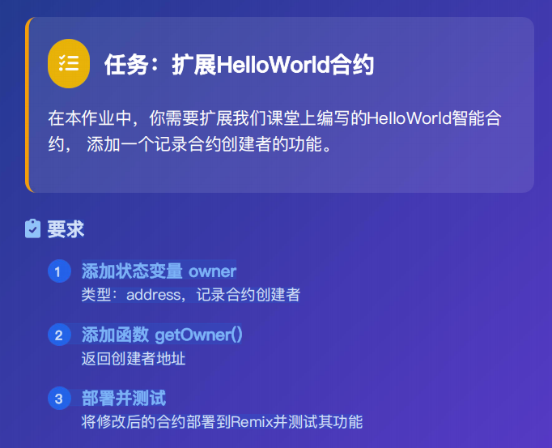
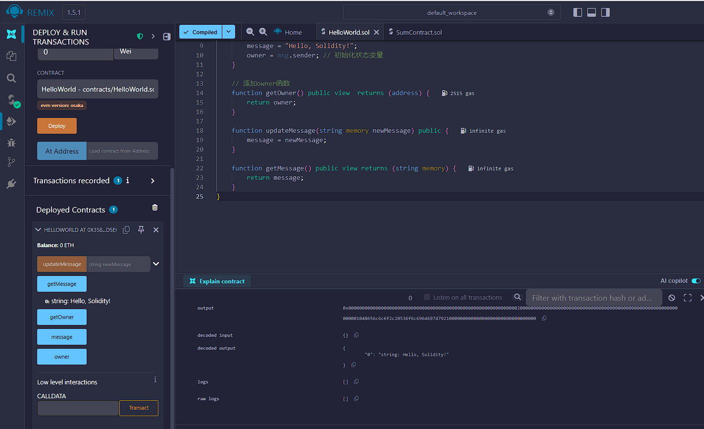
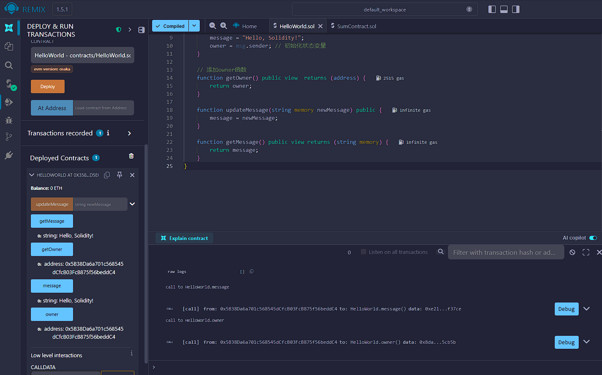
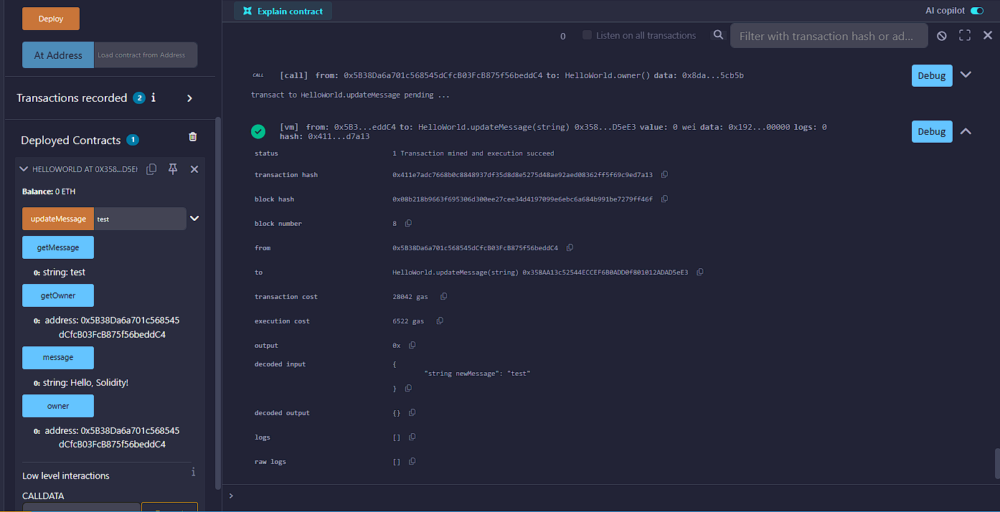

代码:
```
// SPDX-License-Identifier: MIT
pragma solidity ^0.8.0;

contract HelloWorld {
    string public message;
    address public owner; //添加状态变量

    constructor() {
        message = "Hello, Solidity!";
        owner = msg.sender; // 初始化状态变量
    }

    // 添加owner函数
    function getOwner() public view  returns (address) {
        return owner;
    }

    function updateMessage(string memory newMessage) public {
        message = newMessage;
    }

    function getMessage() public view returns (string memory) {
        return message;
    }
}
```



