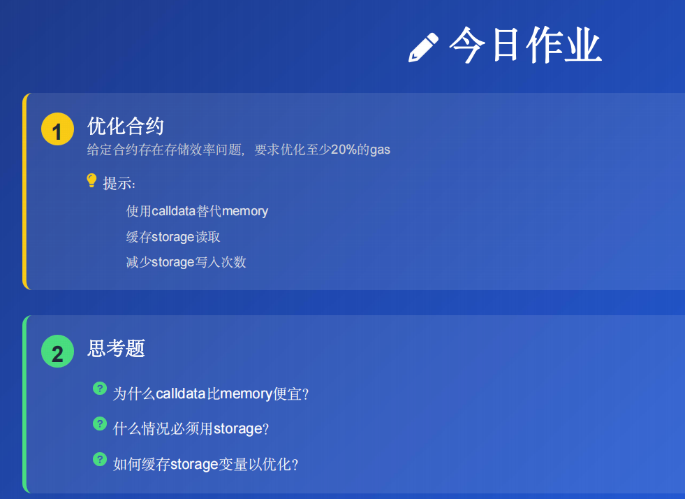
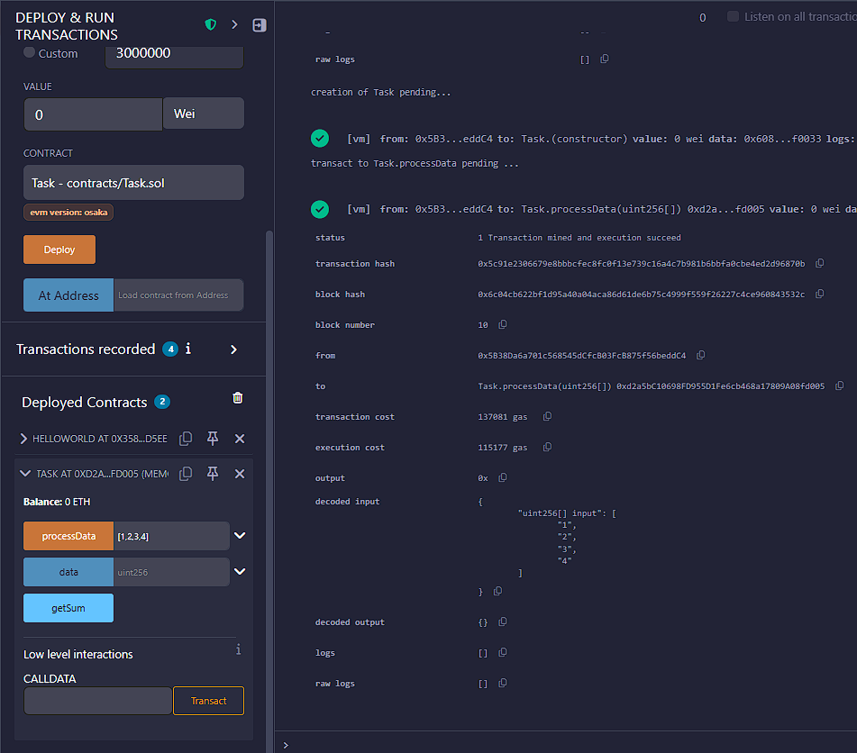
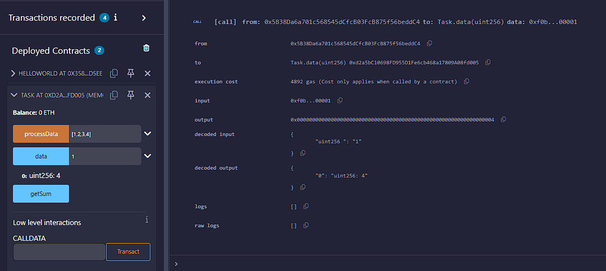
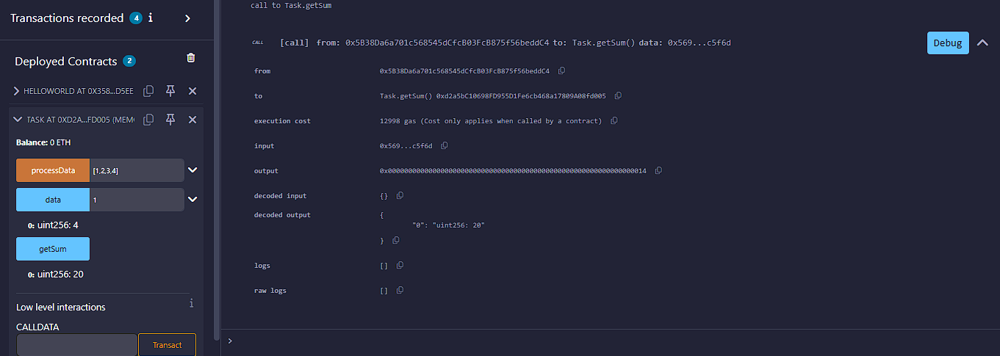
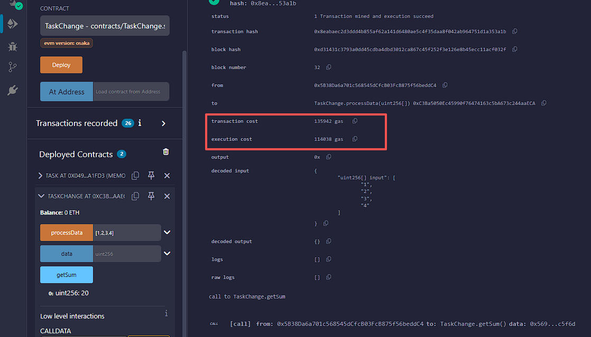
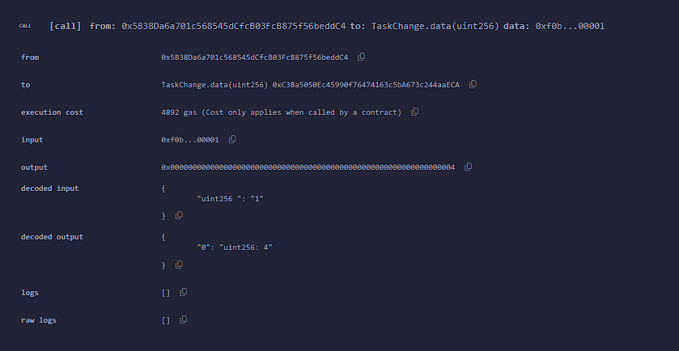
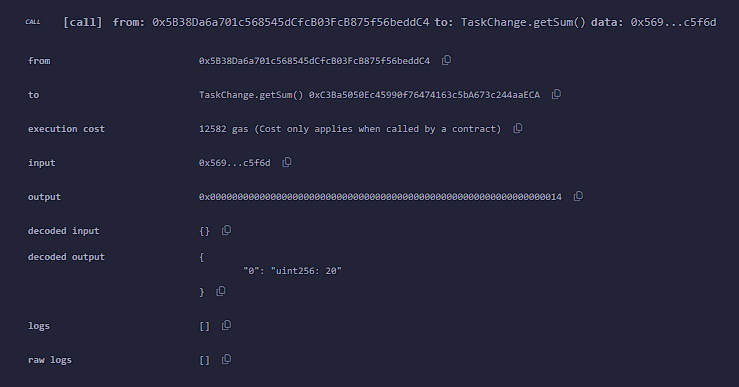

原task.sol
```
// SPDX-License-Identifier: MIT
pragma solidity ^0.8.0;

contract Task {
    uint[] public data;

    // 这个函数有很多优化空间
    function processData(uint[] memory input) public {
        delete data;  // 清空数组
        for(uint i = 0; i < input.length; i++) {
            data.push(input[i] * 2);
        }
    }

    // 这个函数也可以优化
    function getSum() public view returns (uint) {
        uint sum = 0;
        for(uint i = 0; i < data.length; i++) {
            sum += data[i];
        }
        return sum;
    }
}
```
函数执行耗费的gas



个人修改后的
```
// SPDX-License-Identifier: MIT
pragma solidity ^0.8.0;

contract TaskChange {
    uint[] public data;

    
    function processData(uint[] calldata input) public {
        data = new uint[](0);  
        uint len = input.length;
        for(uint i = 0; i < len; i++) {
            data.push(input[i] * 2);
        }
    }

    
    function getSum() public view returns (uint) {
        uint sum = 0;
        uint len = data.length;
        for(uint i = 0; i < len; i++) {
            sum += data[i];
        }
        return sum;
    }
}
```
函数执行耗费的gas




第一个函数更改了入参类型为calldata，将input.length提取为len
第二个函数将data.length提取为len，防止频繁读取