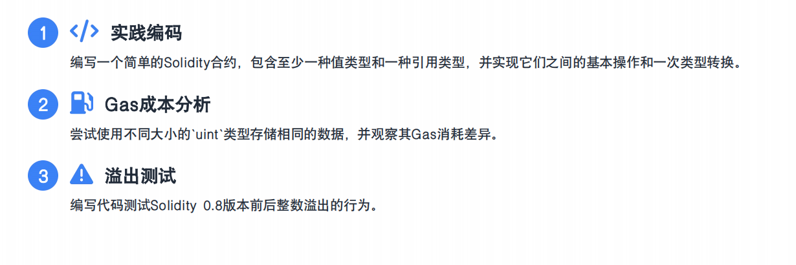

```solidity
// SPDX-License-Identifier: MIT
pragma solidity ^0.8.0;

contract Simple{

    uint public num1;

    string public message;
    address public addre;

    constructor() {
        num1 = 100;
        message = "test";
        addre = msg.sender;
    }

    function explicitConversion(uint x)public pure returns (uint8){
        uint8 s = uint8(x);
        return s;
    }

    function implicitConversion(uint16 x)public pure returns (uint){
        uint s = x;
        return s;
    }

    function addressConversion(address add)public pure returns (address payable ){
        address payable  a =  payable(address(add));
        return a;
    }

     // address → uint256
    function addressToUint(address _addr) public pure returns (uint256) {
        return uint256(uint160(_addr));
    }
    
    // uint256 → address
    function uintToAddress(uint256 _uint) public pure returns (address) {
        return address(uint160(_uint));
    }

    // 两个字符串比较
    function compareStrings(string memory s1,string memory s2)public pure returns (bool){
        return keccak256(abi.encodePacked(s1))==keccak256(abi.encodePacked(s2));
    }
    
    // 测试溢出
    function testOverflow2()external pure returns(uint8){
        uint8 a = 255;
        uint8 b = 255;
        uint8 sum = a+b;
        return sum;
    }
    
}
```