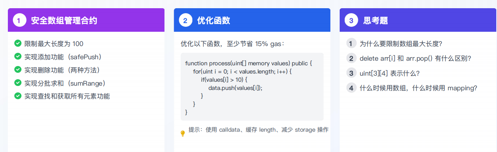

1.代码
```solidity
// SPDX-License-Identifier: MIT
pragma solidity ^0.8.0;

contract SafeArrayManager {
    // 状态变量
    uint256[] private numbers;
    uint256 public constant MAX_LENGTH = 100;
    
    constructor(){
        numbers = [5,6,1,2,3,4,99,88,74,25];
    }

    function safePush(uint val)public {
        require(numbers.length <MAX_LENGTH,"Array is full");
        numbers.push(val);
    }

    function deleteFun1(uint index)public {
        require(numbers.length> 0,"Array is empty");
        for(uint i=index;i<numbers.length-1;i++){
            numbers[i] = numbers[i+1];
        }
        numbers.pop();
    }

    function deleteFun2(uint index)public {
        require(numbers.length> 0,"Array is empty");
        numbers[index] = numbers[numbers.length-1];
        numbers.pop();
    }

    function sumRange(uint start,uint end)public view  returns(uint){
        require(start<end,"params is invalid");
        require(end <numbers.length,"The end index exceeds the array length");
        uint sum = 0;
        for (uint i = start; i<end; i++) 
        {
            sum += numbers[i];
        }
        return  sum;
    }

    function queryEle(uint num)public view returns(uint,bool){
        for(uint i =0;i<numbers.length;i++){
            if(numbers[i] == num){
                return (i,true);
            }
        }
        return (0,false);
    }

    function getAllEle()public view returns(uint[] memory){
        return numbers;
    }
    
}
```
2.源代码
```solidity
function process(uint[] memory values) public {
        for (uint i=0; i<values.length; i++) 
        {
            if(values[i]>10){
                data.push(values[i]);
            }
        }
    }
```
优化后的代码
```solidity
function process(uint[] calldata values) public {
        uint len = values.length;
        for (uint i=0; i<len; i++) 
        {
            uint temp = values[i];
            if(temp>10){
                data.push(temp);
            }
        }
    }
```
优化思路：1.修改入参的memory为calldata  2.提取经常用于判断的values.length为len 3.减少value[i]的访问次数，原来需要访问2*len次，现在只需要访问len次

3.
为什么要限制数组最大长度?
delete arr[i]和 arr.pop()有什么区别?
uint[3][4]表示什么?
什么时候用数组，什么时候用mapping?

数组是十分耗费空间的，如果不加限制，遇到某些操作可能耗尽gas也无法执行完成，因此必须严格的设置数组的最大长度
delete arr[i]是修改arr数组下标为i的元素为默认值 而arr.pop()才是彻底的删除元素
二维数组 ：表示四个 数组长度为3的一维数组
需要遍历所有元素的时候用数组，不需要遍历的时候用mapping