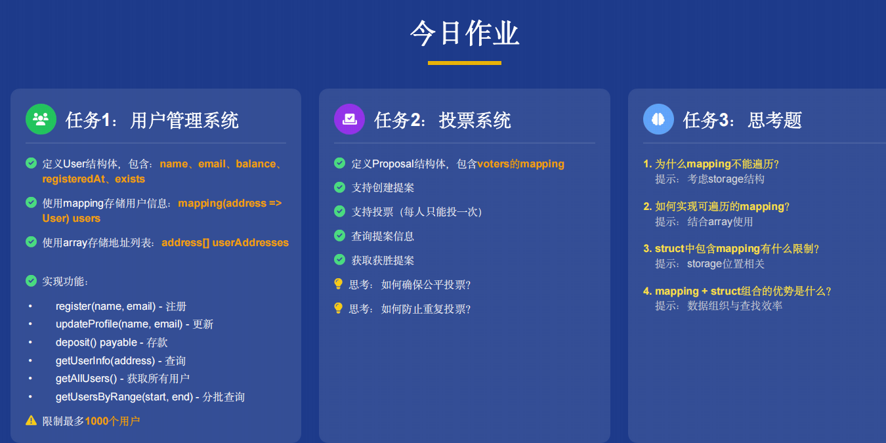

1.
```solidity
// SPDX-License-Identifier: MIT
pragma solidity ^0.8.0;


contract UserManager {

    struct User{
        string name;
        string email;
        uint balance;
        uint registeredAt;
        bool exists;
    }

    mapping (address =>User) public users;
    address[] public userAddresses;
    uint public userCount;
    uint public constant MAX_USERS = 1000;


    event UserRegistered(address indexed user,string name);
    event UserUpdated(address indexed user);
    event Deposit(address indexed user,uint amount);

    function register(string memory name,string memory email)public {
        require(!users[msg.sender].exists,"User aready registered");
        require(userCount<MAX_USERS,"Maximum user limit reached");
        require(bytes(name).length >0,"Name require");
        require(bytes(email).length >0,"Email require");
        users[msg.sender] = User({
            name:name,
            email:email,
            balance:0,
            registeredAt:block.timestamp,
            exists:true
        });
        userAddresses.push(msg.sender);
        userCount++;

        emit UserRegistered(msg.sender, name);
    }

    function updateProfile(string memory name,string memory email)public {
        require(users[msg.sender].exists,"User not registered");
        require(bytes(name).length >0,"Name require");
        require(bytes(email).length >0,"Email require");

        users[msg.sender].name = name;
        users[msg.sender].email = email;

        emit UserUpdated(msg.sender);
    }

    function deposit()public payable{
        require(users[msg.sender].exists,"User not registered");
        require(msg.value >0,"Must send ETH");

        users[msg.sender].balance += msg.value;
        emit Deposit(msg.sender, msg.value);
    }

    function getUserInfo(address _usr)public view returns(User memory) {
        require(users[_usr].exists,"User not found");
        return users[_usr];
    }

    function getAllUser()public view returns (address[] memory){
        return userAddresses;
    }

    function getUsersByRange(uint start,uint end)public view returns (address[] memory){
        require(start < end,"Invalid range");
        require(end<userAddresses.length,"End out of bounds");
        uint len = end-start;
        address[] memory result = new address[](len);
        for (uint i=0; i < len; i++) 
        {
            result[i] = userAddresses[start+i];
        }
        return result;
    }

    function isRegistered(address _usr)public view returns (bool){
        return users[_usr].exists;
    }

}
```
2.

```solidity
// SPDX-License-Identifier: MIT
pragma solidity ^0.8.0;

contract VoteManager{
    struct Proposal{
        string desc; // 提议的描述信息
        uint voteCount; // 投票的个数
        uint deadline;  // 提议终止时间
        bool executed;  // 是否执行
        mapping(address => bool) voters; // 投票的用户
    }

    mapping (uint => Proposal) public proposals; // 存储所有的提议信息
    uint public proposalCount;  // 存储提议的个数

    event proposalCreate(uint indexed proposalId,string desc);
    event Voted(uint indexed proposalId,address indexed voter);

    // 创建提议
    function createPorposal(string memory _desc,uint duration)public returns (uint){
        require(bytes(_desc).length>0,"Description required");
        require(duration>0,"Duration must be positive");
        uint proposalId = proposalCount++;
        Proposal storage p = proposals[proposalId];
        p.desc = _desc;
        p.voteCount = 0;
        p.deadline = block.timestamp+duration;
        p.executed = false;

        emit proposalCreate(proposalId,_desc);
        return proposalId;
    }

    // 投票
    function vote(uint proposalId)public{
        require(proposalId < proposalCount,"Proposal does not exist");
        Proposal storage p = proposals[proposalId];
        require(p.deadline > block.timestamp,"Voting has ended");
        require(!p.voters[msg.sender],"Already voted");
        p.voters[msg.sender] = true;
        p.voteCount++;
        emit Voted(proposalId,msg.sender);
    }

    // 根据提议id查询提议内容，返回值有标明具体含义，方便查看
    function queryProposal(uint proposalId)public view returns (uint pId,string memory _desc,uint _voteCount,uint _deadline){
        require(proposalId < proposalCount,"Proposal does not exist");
        Proposal storage p = proposals[proposalId];
        return (proposalId,p.desc,p.voteCount,p.deadline);
    }

    // 获取最终胜利的提议id
    function getWinProposal()public view returns(uint pId){
        uint maxVotes = 0;
        for (uint i=0; i<proposalCount; i++) 
        {
            if (proposals[i].voteCount > maxVotes) {
                maxVotes = proposals[i].voteCount;
                pId = i;
            }
        }
        return pId;
    }
}
```
思考1：投票设置时间窗口，增加黑名单和白名单，只允许有资格投票的人进行投票，然后控制投票人投议题不被其他人查看，这样其他人员投票不会被已经投票的人员影响
思考2：针对提议这个结构体设置投票人的mapping类型字段，key是投票人，value为是否已投票。这样就能确保每个人只能投一次票

3.
1.因为Mapping底层实现不存储key，而是通过一个hash函数计算存储位置，然后取这个位置的值，理论上可以有无限的key，因此不能遍历，而且如果遍历的话因为要消耗gas，成本巨大。
2.想要实现可遍历的Mapping，可以加个Array的字段，来存储需要遍历的key，这样就能在Array的有限范围内进行遍历了。
3.只能在storage中使用，不能用在memory和calldata中。不能作为函数参数，也不能作为函数的返回值。不能在数组中。
4.Mapping+Struct可以实现遍历的mapping，进行查询时具有O(1)的时间复杂度，是一种强大的数据结构组合。