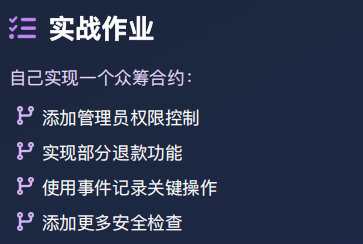

```solidity
// SPDX-License-Identifier: MIT
pragma solidity ^0.8.0;

/**
1.仅管理员可以操作众筹项目的状态【暂停和恢复】
2.部分退款阶段在进行中的时候才可以执行，每个用户只能退款一次，如果本人账户本身没有贡献，却调用了部分退款函数，不算操作了退款
3.部分退款金额	用户自己决定（≤ 净贡献）
4.部分退款后总额	减少
5.项目方提款条件	Success 状态 + 未提过款
6.全额退款触发	    众筹失败（Failed 状态）
7.项目流转：
        进行中--》成功--》资金已发放给项目方
        进行中--》失败--》贡献者可以申请全额退款
**/
contract Crowdfunding{

    enum State {
    Ongoing,      // 0：进行中（募资/项目运行中）
    Successful,   // 1：成功（达标结束）
    Failed,       // 2：失败（未达标结束）
    PaidOut,       // 3：资金已发放 / 退款完成
    Pause           // 4:项目暂停中[管理员操作]
    }
    address public immutable ADMIN; //管理员地址
    address public immutable CREATOR; //项目的创建者
    uint256 public immutable GOAL; //项目目标筹集的金额
    uint256 public immutable DEADLINE; //截止日期
    uint256 public constant MINIMUM_CONTRIBUTION = 0.01 ether;
    uint256 public amountRaised; //已筹集的金额
    uint256 public contributorCount; // 项目总共贡献的用户个数
    State public currentState = State.Ongoing; //设置当前项目状态为进行中
    mapping(address => uint) public contributions; // 存有贡献者贡献金额的mapping
    mapping(address => bool) public contributionsPartialRefund; // 存有贡献者是否进行过部分退款的mapping
    address[] public contributors; // 参与贡献的用户地址数组

    // 构造函数，为合约众筹项目的目标金额和截止时间赋值
    constructor(uint goal, uint durationDays) {
        require(goal >0,"Goal must be positive");
        require(durationDays >= 1 && durationDays <= 30,"Duration: 1-30 days");
        ADMIN = msg.sender;
        CREATOR = msg.sender;
        GOAL = goal *10**18;
        DEADLINE = block.timestamp + (durationDays * 1 days);
    }

    event PartRefund(address indexed contributor,uint256 amount); // 部分退款事件
    event FullRefund(address indexed contributor,uint256 amount); // 全额退款事件
    event Contribution(address indexed contributor, uint256 amount); // 贡献者捐款事件
    event Withdraw(address indexed creator, uint256 amount); // 项目方取款事件
    event StateUpdated(State newState); // 项目状态更新事件

    // 只允许管理员调用
    modifier onlyAdmin(){
        require(msg.sender == ADMIN,"only admin can call");
        _;
    }

    // 只允许项目进行中调用
    modifier inState(State expectSatate){
        require(currentState == expectSatate,"Invalid state");
        _;
    }

    // 部分退款
    function partialRefund(uint256 partAmount) public inState(State.Ongoing) {
        uint amount = contributions[msg.sender];
        require(amount > 0, "No contribution");
        require(partAmount > 0, "Refund amount must be greater than 0");  // 防止退0
        require(amount >= partAmount, "The refund amount exceeded the balance.");
        require(amountRaised >= partAmount, "Insufficient funds in campaign");
        require(!contributionsPartialRefund[msg.sender], "You have already refunded partially.");

        // 先更新状态（防重入）
        contributions[msg.sender] -= partAmount;
        contributionsPartialRefund[msg.sender] = true;
        amountRaised -= partAmount;

        // 后转账
        (bool sent, ) = msg.sender.call{value: partAmount}("");
        require(sent, "Refund failed");

        emit PartRefund(msg.sender, partAmount);
    }

    // 全退款
    function fullRefund() public inState(State.Failed){
        uint256 remaining = contributions[msg.sender];
        require(remaining > 0, "No balance to refund");
        require(amountRaised >= remaining, "Insufficient funds");
        
        // 清除状态
        contributions[msg.sender] = 0;
        amountRaised -= remaining;
        

        (bool sent, ) = msg.sender.call{value: remaining}("");
        require(sent, "Refund failed");
        
        emit FullRefund(msg.sender, remaining);
    }
    // 项目方提取
    function withdraw() public inState(State.Successful) {
        require(msg.sender == CREATOR, "Only creator can withdraw");
        require(amountRaised > 0, "No funds to withdraw");

        uint256 withdrawAmount = amountRaised;
        amountRaised = 0;  // 先清零，防重入
        currentState = State.PaidOut;  // 更新状态为已发放

        (bool sent, ) = CREATOR.call{value: withdrawAmount}("");
        require(sent, "Withdrawal failed");

        emit Withdraw(CREATOR, withdrawAmount);
    }
    // 贡献者捐款
    function contribute() public payable inState(State.Ongoing) {
        require(block.timestamp < DEADLINE, "project has ended");
        require(msg.value >= MINIMUM_CONTRIBUTION, "Contribution too low");
        
        // 首次贡献者，增加贡献者计数
        if (contributions[msg.sender] == 0) {
            contributors.push(msg.sender);
            contributorCount++;
        }
        
        // 更新贡献金额
        contributions[msg.sender] += msg.value;
        amountRaised += msg.value;
        
        // 检查是否达到目标，自动更新状态
        if (amountRaised >= GOAL) {
            currentState = State.Successful;
        }
        
        emit Contribution(msg.sender, msg.value);
    }
    // 获取当前项目信息
    function getProjectInfo() public view returns (
        address admin,
        address creator,
        uint256 goal,
        uint256 deadline,
        uint256 amountRaised_,
        uint256 contributorCount_,
        State currentState_,
        uint256 timeRemaining
    ) {
        admin = ADMIN;
        creator = CREATOR;
        goal = GOAL;
        deadline = DEADLINE;
        amountRaised_ = amountRaised;
        contributorCount_ = contributorCount;
        currentState_ = currentState;
        
        // 计算剩余时间（如果未结束）
        if (block.timestamp < DEADLINE && currentState == State.Ongoing) {
            timeRemaining = DEADLINE - block.timestamp;
        } else {
            timeRemaining = 0;
        }
    }
    // 获取当前项目的状态
    function getState()public view returns(State){
        if(block.timestamp >= DEADLINE && currentState ==State.Ongoing){
            if(amountRaised >= GOAL){
                return State.Successful;
            }else {
                return  State.Failed;
            }
        }
        return currentState;
    }
    // 获取众筹进度
    function getProgress()public view returns(uint256 percentage, uint256 decimals){
        percentage = (amountRaised * 100) / GOAL;  // 整数部分
        decimals = ((amountRaised * 10000) / GOAL) % 100;
        return (percentage, decimals);
    }
    // 获取当前项目是否结束
    function isEnded() public view returns (bool) {
        return (block.timestamp >= DEADLINE) || (currentState != State.Ongoing);
    }
    // 检查并更新状态
    function checkGoalReached() public inState(State.Ongoing){
        require(block.timestamp >= DEADLINE, "project not ended yet");
        if(amountRaised >= GOAL){
            currentState = State.Successful;
            emit StateUpdated(State.Successful);
        }else{
            currentState = State.Failed;
            emit StateUpdated(State.Failed);
        }
    }
    // 暂停项目
    function pauseProject()public onlyAdmin inState(State.Ongoing){
        currentState = State.Pause;
        emit StateUpdated(State.Pause);
    }
    // 恢复项目
    function recoverProject()public onlyAdmin inState(State.Pause){
       // 检查项目是否已到期
        if (block.timestamp >= DEADLINE) {
            // 项目已到期，根据筹款情况决定最终状态
            if (amountRaised >= GOAL) {
                currentState = State.Successful;
            } else {
                currentState = State.Failed;
            }
        } else {
            // 项目未到期，恢复为进行中
            currentState = State.Ongoing;
        }
        
        emit StateUpdated(currentState);
    }
}
```
1.管理员权限
```TEXT
暂停和恢复众筹项目状态操作只有管理员能操作
```
2.实现部分退款
```TEXT
目前系统设计的是只允许贡献者在项目进行中，并且自己从未申请过部分退款的状态下可以进行部分退款，并且退款的金额不能超过自己贡献的总金额
```
3.事件记录
```TEXT
event PartRefund(address indexed contributor,uint256 amount); // 部分退款事件
event FullRefund(address indexed contributor,uint256 amount); // 全额退款事件
event Contribution(address indexed contributor, uint256 amount); // 贡献者捐款事件
event Withdraw(address indexed creator, uint256 amount); // 项目方取款事件
event StateUpdated(State newState); // 项目状态更新事件
```
4.添加更多安全检查
```TEXT
在每个方法的代码执行之前都是用了required进行安全检查，有些函数加入了modifier的语法进行安全检查
```