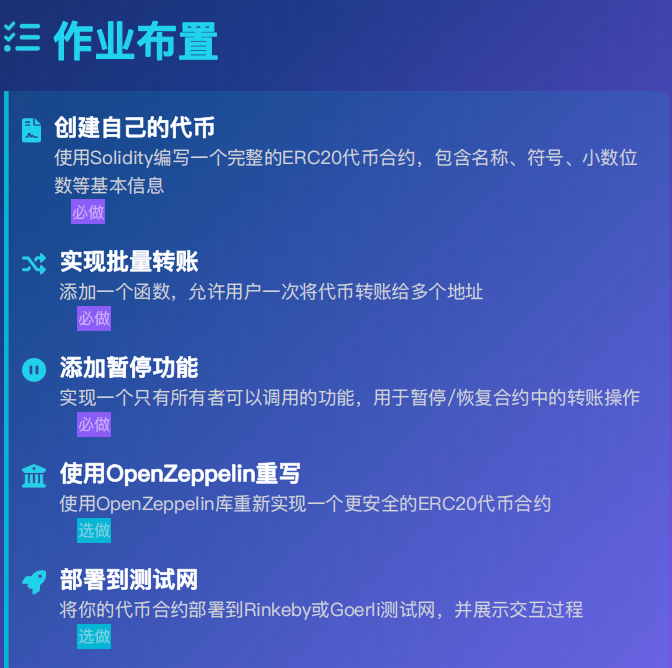

自己的代币
```solidity
// SPDX-License-Identifier: MIT
pragma solidity ^0.8.0;

contract MyToken {
    // 代币元数据
    string private _name;
    string private _symbol;
    uint8 private _decimals;
    bool private _pause;
    address private _owner;
    
    // 总供应量
    uint256 private _totalSupply;
    
    // 余额映射
    mapping(address => uint256) private _balances;
    
    // 授权映射: 所有者 => (授权地址 => 授权额度)
    mapping(address => mapping(address => uint256)) private _allowances;
    
    // 事件
    event Transfer(address indexed from, address indexed to, uint256 value); //转账
    event Approval(address indexed owner, address indexed spender, uint256 value); //授权
    event Mint(address indexed to, uint256 value); // 铸造代币
    event Burn(address indexed from, uint256 value); // 销毁代币
    event Paused(address indexed account);  // 合约暂停服务
    event Unpaused(address indexed account);    //合约恢复服务
    event BatchTransfer(address indexed from,address[] recipients,uint256[] amounts); //批量转账
    
    modifier onlyOwner(){
        require(msg.sender == _owner,"only owner can call");
        _;
    }

    modifier whenNotPause(){
        require(!_pause,"contract is pause");
        _;
    }

    modifier whenPause(){
        require(_pause,"contract not pause");
        _;
    }


    // 构造函数
    constructor(string memory name_, string memory symbol_, uint256 initialSupply) {
        _name = name_;
        _symbol = symbol_;
        _decimals = 18;
        _owner = msg.sender;
       
        uint256 initialSupplyWithDecimals = initialSupply * 10 ** _decimals;
        _totalSupply = initialSupplyWithDecimals;
        _balances[msg.sender] = initialSupplyWithDecimals;
        
        emit Transfer(address(0), msg.sender, initialSupplyWithDecimals);
    }
    
    
    function name() public whenNotPause view returns (string memory) {
        return _name;
    }
    
    
    function symbol() public whenNotPause view returns (string memory) {
        return _symbol;
    }
    
    
    function decimals() public whenNotPause view returns (uint8) {
        return _decimals;
    }
    
    // 查询总供应量
    function totalSupply() public whenNotPause view returns (uint256) {
        return _totalSupply;
    }
    
    // 查询余额
    function balanceOf(address account) public whenNotPause view returns (uint256) {
        return _balances[account];
    }
    
    // 查询授权额度
    function allowance(address owner, address spender) public whenNotPause view returns (uint256) {
        return _allowances[owner][spender];
    }

    // 直接转账
    function transfer(address recipient, uint256 amount) public whenNotPause returns (bool) {
        require(recipient != address(0), "ERC20: transfer to the zero address");
        require(amount <= _balances[msg.sender], "ERC20: insufficient balance");
        
        _balances[msg.sender] -= amount;
        _balances[recipient] += amount;
        
        emit Transfer(msg.sender, recipient, amount);
        return true;
    }
    
    // 授权
    function approve(address spender, uint256 amount) public whenNotPause returns (bool) {
        require(spender != address(0), "ERC20: approve to the zero address");
        
        _allowances[msg.sender][spender] = amount;
        emit Approval(msg.sender, spender, amount);
        return true;
    }
    
    // 授权转账,使用授权额度，从授权人账户转移代币到指定地址
    function transferFrom(address sender, address recipient, uint256 amount) public whenNotPause returns (bool) {
        require(sender != address(0), "ERC20: transfer from the zero address");
        require(recipient != address(0), "ERC20: transfer to the zero address");
        require(amount <= _balances[sender], "ERC20: insufficient balance");
        require(amount <= _allowances[sender][msg.sender], "ERC20: insufficient allowance");
        
        _allowances[sender][msg.sender] -= amount;
        _balances[sender] -= amount;
        _balances[recipient] += amount;
        
        emit Transfer(sender, recipient, amount);
        return true;
    }
    
    // 铸造代币
    function mint(address account, uint256 amount) public whenNotPause {
        require(account != address(0), "ERC20: mint to the zero address");
        require(amount > 0, "ERC20: mint amount must be greater than 0");
        
        _totalSupply += amount;
        _balances[account] += amount;
        
        emit Mint(account, amount);
        emit Transfer(address(0), account, amount);
    }
    
    // 销毁代币
    function burn(uint256 amount) public whenNotPause {
        require(amount > 0, "ERC20: burn amount must be greater than 0");
        require(amount <= _balances[msg.sender], "ERC20: insufficient balance to burn");
        
        _totalSupply -= amount;
        _balances[msg.sender] -= amount;
        
        emit Burn(msg.sender, amount);
        emit Transfer(msg.sender, address(0), amount);
    }

    // 合约暂停
    function pauseContract()external  onlyOwner whenNotPause{
        _pause = true;
        emit Paused(_owner);
    }

    // 合约恢复
    function unPauseContract()external  onlyOwner whenNotPause{
        _pause = false;
        emit Unpaused(_owner);
    }
    
    // 合约批量转账给多个账户，这里限制了只能批量往10个用户地址转账，担心gas成本过高导致交易失败
    function batchTransfer(address[] memory recipients, uint256[] memory amounts) public whenNotPause returns (bool) {
        uint reLen = recipients.length;
        require(reLen > 0, "ERC20: no recipients");
        require(reLen <= 10, "ERC20: recipients should less 11");
        require(amounts.length==reLen,"BatchTransfer: array length mismatch");

        uint totalAmount = 0;

        for (uint i = 0; i< reLen; i++) 
        {
            require(recipients[i] != address(0),"BatchTransfer: transfer to zero address");
            totalAmount += amounts[i];
        }

        require(totalAmount <= _balances[msg.sender],"ERC20: insufficient balance to transfer");

        for (uint i = 0; i< reLen; i++)
        {
            _balances[msg.sender] -= amounts[i];
            _balances[recipients[i]] += amounts[i];
            emit Transfer(msg.sender, recipients[i], amounts[i]);
        }
   

        emit BatchTransfer(_owner, recipients, amounts);
        return true;
    }
}
```